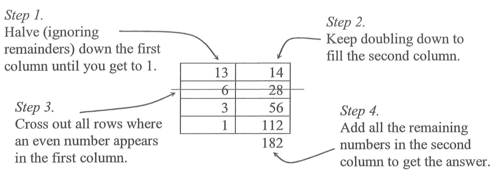

Learn pseudocode with javascript compliant with Board of studies, New South Wales, Australia, Software Design and Development Stage 6, Software and Course Specifications Higher School Certificiate 2012


[](https://nodei.co/npm/boscode-learn/)
[](https://nodei.co/npm/boscode-learn/)

See also [boscode](https://github.com/Quobject/boscode).

## Table of Content
[Installation](#installation)  
[Useful bash terminal commands](#useful-bash-terminal-commands)  

*Example code*  
[01 Console output: Display](#01-console-output-display)  
[02 Console input: Get](#02-console-input-get)  
[03 Creating a sequential file](#03-creating-a-sequential-file)  
[04 Printing the contents of a file using sentinel value](#04-printing-the-contents-of-a-file-using-sentinel-value)  
[05 Printing the contents of a file using EOF (end of file)](#05-printing-the-contents-of-a-file-using-eof-end-of-file)  
[06 Appending rows to an existing sequential file](#06-appending-rows-to-an-existing-sequential-file)  
[07 Creating a relative file](#07-creating-a-relative-file)  
[08 Reading from a relative file](#08-reading-from-a-relative-file)  
[09 Updating records in a relative file](#09-updating-records-in-a-relative-file)  

*Tasks*  
[01 Variables](#01-variables)  
[02 Strings](#02-strings)  
[03 String length](#03-string-length)  
[04 Revising strings](#04-revising-strings)  
[05 Numbers](#05-numbers)  
[06 Rounding numbers](#06-rounding-numbers)  
[07 Number to string](#07-number-to-string)  
[08 If statement](#08-if-statement)  
[09 For loop](#09-for-loop)  
[10 Arrays](#10-arrays)  
[11 Array filtering](#11-array-filtering)  
[12 Accessing array values](#12-accessing-array-values)  
[13 Looping through arrays](#13-looping-through-arrays)  
[14 Objects](#14-objects)  
[15 Object properties](#15-object-properties)  
[16 Functions](#16-functions)  
[17 Function arguments](#17-function-arguments)  
[18 Sum]( #18-sum )   
[19 Highindex]( #19-highindex )   
[20 Binary sum]( #20-binary-sum )   
[21 Integer addition]( #21-integer-addition )   
[22 Comparing strings]( #22-comparing-strings )   
[23 Digit sum]( #23-digit-sum )   
[24 Highest digit]( #24-highest-digit )   
[25 Test length]( #25-test-length )   
[26 How many e's]( #26-how-many-es )   
[27 Camel case]( #27-camel-case )   
[28 Valid 24 hours]( #28-valid-24-hours )   
[29 AM & PM]( #29-am--pm )   
[30 Word index]( #30-word-index )   
[31 Sorted index]( #31-sorted-index )   
[32 Formatted index]( #32--formatted-index )   
[33 Length conversion]( #33-length-conversion )   
[34 Highest Integer]( #34-highest-integer )   
[35 Multiple words]( #35-multiple-words )   
[36 Odd numbers]( #36-odd-numbers )   
[37 Vowels]( #37-vowels )   
[38 Bar code]( #38-bar-code )   
[39 Runs]( #39-runs )   
[40 Printing numbers]( #40-printing-numbers )   
[41 Average]( #41-average )   
[42 Counting $]( #42-counting- )   
[43 Words and characters]( #43-words-and-characters )   
[44 Kaprekar Numbers]( #44-kaprekar-numbers )   
[45 Digital Roots]( #45-digital-roots )   
[46 Plurals]( #46-plurals )   
[47 Team Counts]( #47-team-counts )   
[48 Staircases]( #48-staircases )   
[49 Two-up]( #49-two-up )   
[50 Rank Generator]( #50-rank-generator )   
[51 Range check](  )   
[52 Grade](  )   
[53 Repeat the character](  )   
[54 Group bits](  )   
[55 Peasant multiplication](  )   


*Codecademy Tasks*  
[codecademy tasks](https://github.com/Quobject/boscode-doc/blob/master/doc/codecademy/codecademy-tasks.md)

*Arduino Tasks*  
[arduino tasks](https://github.com/Quobject/boscode-doc/blob/master/doc/arduino/arduino-tasks.md)

*Electron Tasks*  
[electron tasks](https://github.com/Quobject/boscode-doc/blob/master/doc/electron/electron-tasks.md)

*Object oriented paradigm*  
[1 Object oriented paradigm](https://github.com/Quobject/boscode-doc/blob/master/doc/SDD/learning_activities.md#1-object-oriented-paradigm)

*Google Apps Script Tasks*  
[Google Apps Script Tasks](https://github.com/Quobject/boscode-doc/blob/master/doc/google-apps-script/google-apps-script-tasks.md)

*Web tasks*  
[Web tasks](https://github.com/Quobject/boscode-doc/blob/master/doc/web/web-tasks.md#web-tasks)

## Installation

1. Create a cloud 9 account: cloud 9 https://c9.io/. Use your school email address and set username to stlukes-{first part of school email}. 
2. In c9.io: Create a new workspace: 
  * Workspace name: `boscode-learn`
  * Description: `Learning javascript`
  * Hosted workspace: `Public`
  * Clone from Git or Mercurial URL: `https://github.com/Quobject/boscode-learn.git`
  * Choose a template: `Blank`
  * Hit 'Create workspace' button
3. Inside your workspace on the left side right click the folder name 'boscode-learn' and select 'Open Terminal Here'
4. In your terminal type the command 

```bash
npm install
```

## Useful bash terminal commands

* `pwd`: 
```bash
{yourname}:~/workspace (master) $ pwd
/home/ubuntu/workspace
```
print working directory

* `ll`:
```bash
{yourname}:~/workspace (master) $ ll
total 64
drwxr-xr-x  7 ubuntu ubuntu 4096 Jan 21 01:57 ./
drwxr-xr-x 21 ubuntu ubuntu 4096 Jan 21 01:57 ../
drwxr-xr-x  3 ubuntu ubuntu 4096 Jan 21 01:56 .c9/
-rw-r--r--  1 ubuntu ubuntu  208 Jan 21 01:56 .editorconfig
drwxr-xr-x  8 ubuntu ubuntu 4096 Jan 21 01:56 .git/
-rw-r--r--  1 ubuntu ubuntu 4290 Jan 21 01:56 .gitignore
-rw-r--r--  1 ubuntu ubuntu  249 Jan 21 01:56 .jshintrc
drwxr-xr-x  4 ubuntu ubuntu 4096 Jan 21 01:56 .vs/
-rw-r--r--  1 ubuntu ubuntu 1075 Jan 21 01:56 LICENSE
-rw-r--r--  1 ubuntu ubuntu 2284 Jan 21 01:56 README.md
-rw-r--r--  1 ubuntu ubuntu 3850 Jan 21 01:56 boscode-learn.njsproj
-rw-r--r--  1 ubuntu ubuntu  971 Jan 21 01:56 boscode-learn.sln
drwxr-xr-x  3 ubuntu ubuntu 4096 Jan 21 01:56 code/
drwxr-xr-x  3 ubuntu ubuntu 4096 Jan 21 01:57 node_modules/
-rw-r--r--  1 ubuntu ubuntu  621 Jan 21 01:56 package.json
```
list files

* `cd`:
```bash
{yourname}:~/workspace (master) $ cd code
{yourname}:~/workspace/code (master) $ 
```
change directory

## Example code

### 01 Console output: Display
1. Open your cloud 9 workspace (see above). In the file tree open the folder: `~/workspace/code/examples/01`
2. Double click the file `app.js` inside this folder. Observe the code:

```js    
var boscode = require('boscode');

boscode.display('Hello world');

boscode.display('The answer is ', 4, 'km');
```
3. Right click the file `app.js` and choose `Open Terminal Here`.
4. Type `ll` to see the content of the current directory:
```js
{yourname}:~/workspace/code/examples/01 (master) $ ll
total 12
drwxr-xr-x  2 ubuntu ubuntu 4096 Jan 21 01:56 ./
drwxr-xr-x 11 ubuntu ubuntu 4096 Jan 21 01:56 ../
-rw-r--r--  1 ubuntu ubuntu  115 Jan 21 01:56 app.js
```
5. Type `node app.js` to run this code:
```bash
{yourname}:~/workspace/code/examples/01 (master) $ node app.js 
Hello world
The answer is 4km
```
6. Follow similar procedure to see/run the other code examples.

See also: https://github.com/Quobject/boscode#display


### 02 Console input: Get

Pseudocode
```
Get firstNumber
```

Javascript
```js
var firstNumber = boscode.get();
```

In your cloud 9 workspace run the file 
[app.js](https://github.com/Quobject/boscode-learn/blob/master/code/examples/02/app.js) `code/examples/02/app.js`. 


### 03 Creating a sequential file

Pseudocode
```
BEGIN CreateASequentialFile
  Open FriendsData for output

  firstName = "Joe"
  lastName = "Bloggs"
  emailAddress = "jbloggs@example.com"

  Write FriendsData from firstName, lastName, emailAddress

  firstName = "Jim"
  lastName = "Doe"
  emailAddress = "jdoe@example.com"

  Write FriendsData from firstName, lastName, emailAddress

  Close FriendsData
END CreateASequentialFile


```

Javascript
```js

var createASequentialFile = function () {
  var friendsData = boscode.open('friendsData.txt', 'output');

  var firstName = 'Joe';
  var lastName = 'Bloggs';
  var emailAddress = 'jbloggs@example.com';

  var row = [firstName, lastName, emailAddress].join(','); // creates a comma separated string

  friendsData.write(row);  

  firstName = 'Jim';
  lastName = 'Doe';
  emailAddress = 'jdoe@example.com';

  row = [firstName, lastName, emailAddress].join(','); // creates a comma separated string

  friendsData.write(row);

  friendsData.close();
};

// content of friendsData.txt:
// Joe,Bloggs,jbloggs@example.com
// Jim,Doe,jdoe@example.com

```


In your cloud 9 workspace run the file  
[app.js](https://github.com/Quobject/boscode-learn/blob/master/code/examples/03/app.js) `code/examples/03/app.js`.


### 04 Printing the contents of a file using sentinel value

Pseudocode
```
BEGIN DisplayFileContents
  Open FriendsData for input

  Read firstName, lastName, emailAddress from FriendsData
  ’This is a priming read, performed just before entering the loop to provide
  'the first record (if there is one) for printing

  WHILE firstName <> “xxx”
    Display firstName, lastName, emailAddress
    Read firstName, lastName, emailAddress from FriendsData
    ’this reads subsequent records which can then be tested for the sentinel
    'value before they are processed
  END WHILE

  Close FriendsData
END DisplayFileContents

```

Javascript
```js
var displayFileContents = function () {
  var friendsData = boscode.open('friendsData.txt', 'input');

  var row = friendsData.read();
  var tempArray = row.split(',');
  var firstName = tempArray[0];
  var lastName = tempArray[1];
  var emailAddress = tempArray[2];

  while ( firstName !== 'xxx' ) {
    boscode.display(firstName, lastName, emailAddress);

    row = friendsData.read();
    tempArray = row.split(',');
    firstName = tempArray[0];
    lastName = tempArray[1];
    emailAddress = tempArray[2];
  }

  friendsData.close();
};


```

In your cloud 9 workspace run the file  
[app.js](https://github.com/Quobject/boscode-learn/blob/master/code/examples/04/app.js) `code/examples/04/app.js`.


### 05 Printing the contents of a file using EOF (end of file)

Pseudocode
```
BEGIN DisplayFileContents
  Open FriendsData for input

  Read firstName, lastName, emailAddress from FriendsData
  ’This is a priming read, performed just before entering the loop to provide
  'the first record (if there is one) for printing

  WHILE not EOF
    Display firstName, lastName, emailAddress
    Read firstName, lastName, emailAddress from FriendsData
    ’this reads subsequent records which can then be tested for the sentinel
    'value before they are processed
  END WHILE

  Close FriendsData
END DisplayFileContents

```

Javascript
```js
var displayFileContents = function () {
  var friendsData = boscode.open('friendsData.txt', 'input');

  var row = friendsData.read();

  var tempArray, firstName, lastName, emailAddress;

  while (row !== boscode.EOF) {
    tempArray = row.split(',');
    firstName = tempArray[0];
    lastName = tempArray[1];
    emailAddress = tempArray[2];
    boscode.display(firstName, lastName, emailAddress);

    row = friendsData.read();
  }

  friendsData.close();
};


```

In your cloud 9 workspace run the file  
[app.js](https://github.com/Quobject/boscode-learn/blob/master/code/examples/05/app.js) `code/examples/05/app.js`.


### 06 Appending rows to an existing sequential file

Pseudocode
```
BEGIN AppendNewRows
  Open FriendsData for append

  Display “Please enter the details for the first new person to be added:”
  Display “Enter xxx for first name to indicate there are no more rows to be added.”

  Get firstName, lastName, emailAddress

  WHILE firstName <> “xxx”
    Write FriendsData from firstName, lastName, emailAddress

    Display “Please enter the details for the next new person to be added:”

    Get firstName, lastName, emailAddress
  END WHILE

  Close FriendsData
END AppendNewRows
```

Javascript
```js
var appendNewRows = function () {
  var friendsData = boscode.open('friendsData.txt', 'append');

  boscode.display('Please enter the details for the first new person to be added:');
  boscode.display('Enter xxx for first name to indicate there are no more rows to be added.');

  var firstName = boscode.get('First Name:');
  var lastName = boscode.get('Last Name:');
  var emailAddress = boscode.get('Email Address:');
  var row = [firstName, lastName, emailAddress].join(',');

  while (firstName !== 'xxx') {

    friendsData.write(row);

    boscode.display('Please enter the details for the next new person to be added:');

    firstName = boscode.get('First Name:');
    lastName = boscode.get('Last Name:');
    emailAddress = boscode.get('Email Address:');
    row = [firstName, lastName, emailAddress].join(',');
  }

  friendsData.close();
};


```

In your cloud 9 workspace run the file  
[app.js](https://github.com/Quobject/boscode-learn/blob/master/code/examples/06/app.js) `code/examples/06/app.js`.


### 07 Creating a relative file

Pseudocode
```
BEGIN CreateARelativeFile
  Open ProductData for relative access

  productNumber = 1
  description = "Laundry Liquid 2L"
  quantity = 100
  price = 1.49

  Write ProductData from productNumber, description, quantity, price using productNumber

  ’note the use of the variable productNumber as the key field, specifying where this record will be written in the file.

  productNumber = 2
  description = "Mate Laundry Liquid 1L"
  quantity = 300
  price = 3.99

  Write ProductData from productNumber, description, quantity, price using productNumber

  Close ProductData
END CreateARelativeFile
```

Javascript
```js
var createARelativeFile = function () {
  var productData = boscode.open('productData.txt', 'relative_access');

  var productObject = {
    productNumber: 1,
    description: 'Laundry Liquid 2L',
    quantity: 100,
    price: 1.49
  };

  productData.write(productObject, 'productNumber');

  productObject = {
    productNumber: 2,
    description: 'Mate Laundry Liquid 1L',
    quantity: 300,
    price: 3.99
  };

  productData.write(productObject, 'productNumber');

  productData.close();
};


```

In your cloud 9 workspace run the file  
[app.js](https://github.com/Quobject/boscode-learn/blob/master/code/examples/07/app.js) `code/examples/07/app.js`.


### 08 Reading from a relative file

Pseudocode
```
BEGIN ReadRecordsFromARelativeFile
  Open ProductData for relative access

  RequiredProdNumber = 1

  Read ProductData into productNumber, description, quantity, price using RequiredProdNumber
  ’note the use of the variable RequiredProdNumber as the key field, specifying where this record will be found in the file
  
  IF RecordNotFound THEN
    ’note the use of the flag RecordNotFound returned by the operating system 
    Display “Sorry – no such product”
  ELSE
    Display productNumber, description, quantity, price
  END IF
  
  Close ProductData
END ReadRecordsFromARelativeFile

```

Javascript
```js
var readRecordsFromARelativeFile = function () {
  var productData = boscode.open('productData.txt', 'relative_access');

  var requiredProdNumber = 1;

  var productRecord = productData.read(requiredProdNumber);

  if (productRecord === boscode.RECORD_NOT_FOUND) {
    boscode.display('Sorry - no such product');
  } else {
    boscode.display( JSON.stringify(productRecord) );
  }    

  productData.close();
};

//{"productNumber":1,"description":"Laundry Liquid 2L","quantity":100,"price":1.49}

```

In your cloud 9 workspace run the file  
[app.js](https://github.com/Quobject/boscode-learn/blob/master/code/examples/08/app.js) `code/examples/08/app.js`.


### 09 Updating records in a relative file

Pseudocode
```
BEGIN UpdateRecordsInARelativeFile
  Open ProductData for relative access

  RequiredProdNumber = 1

  Read ProductData into productNumber, description, quantity, price using RequiredProdNumber
  
  IF RecordNotFound THEN
    'note the use of the flag RecordNotFound returned by the operating system 
    Display “Sorry – no such product”
  ELSE
    Display productNumber, description, quantity, price
    newPrice = 1000

    Write ProductData from productNumber, description, quantity, newPrice using productNumber
    'update record using data for the new price and the existing data in the other fields

  END IF
  
  Close ProductData
END UpdateRecordsInARelativeFile

```

Javascript
```js
var updateRecordsInARelativeFile = function () {
  var productData = boscode.open('productData.txt', 'relative_access');

  var requiredProdNumber = 1;

  var productRecord = productData.read(requiredProdNumber);

  if (productRecord === boscode.RECORD_NOT_FOUND) {
    boscode.display('Sorry - no such product');
  } else {
    boscode.display(JSON.stringify(productRecord));
    productRecord.price = 1000;

    productData.write(productRecord, 'productNumber');
  }

  productData.close();
};


```

In your cloud 9 workspace run the file  
[app.js](https://github.com/Quobject/boscode-learn/blob/master/code/examples/09/app.js) `code/examples/09/app.js`.


## Tasks

### 01 Variables

A variable is a name that can reference a specific value. Variables are declared using `var` followed by the variable's name.

Here's an example:

```js
var example;
```

The above variable is **declared**, but it isn't defined (it does not yet reference a specific value).

Here's an example of defining a variable, making it reference a specific value:

```js
var example = 'some string';
```

###### NOTE 

A variable is **declared** using `var` and uses the equals sign to **define** the value that it references. This is colloquially known as "Making a variable equal a value".

###### The challenge:


In your cloud 9 workspace edit the file  `/home/ubuntu/workspace/code/tasks/01/app.js`.

In that file declare a variable named `example`.

Make the variable `example` equal to the value `'some string'`.

Then use `boscode.display()` to print the `example` variable to the console.

Check to see if your program is correct.


___

### 02 Strings

A **string** is any value surrounded by quotes.

It can be single or double quotes:

```js
'this is a string'

"this is also a string"
```

###### NOTE

Try to stay consistent. In this workshop we'll only use single quotes.

###### The challenge:

In your cloud 9 workspace edit the file  `/home/ubuntu/workspace/code/tasks/02/app.js`.

In that file declare a variable named `someString`:

```js
var someString = 'this is a string';
```

Use `boscode.display()` to print the variable **someString** to the terminal.

Check to see if your program is correct.


___

### 03 String length

You will often need to know how many characters are in a string.

For this you will use the `.length` property. Here's an example:

```js
var example = 'example string';
example.length
```

#### NOTE

Make sure there is a period between `example` and `length`.

The above code will return a **number** for the total number of characters in the string.


#### The challenge:

In your cloud 9 workspace edit the file  `/home/ubuntu/workspace/code/tasks/03/app.js`.

In that file, create a variable named `example`.

**Assign the string `'example string'` to the variable `example`.**

Use `boscode.display()` to print the **length** of the string to the terminal.

Check to see if your program is correct.


___


### 04 Revising strings

You will often need to change the contents of a string.

Strings have built-in functionality that allow you to inspect and manipulate their contents.

Here is an example using the `.replace()` method:

```js
var example = 'this example exists';
example = example.replace('exists', 'is awesome');
boscode.display(example);
```

Note that to change the value that the `example` variable references, we need  
to use the equals sign again, this time with the `example.replace()` method to  
the right of the equals sign.

#### The challenge:

In your cloud 9 workspace edit the file  `/home/ubuntu/workspace/code/tasks/04/app.js`.

Define a variable named `pizza` that references this string: `'pizza is alright'`

Use the `.replace()` method to change `alright` to `wonderful`.

Use `boscode.display()` to print the results of the `.replace()` method to the terminal.

Check to see if your program is correct.


___


### 05 Numbers

Numbers can be integers, like `2`, `14`, or `4353`, or they can be decimals,  
also known as floats, like `3.14`, `1.5`, or `100.7893423`.
Unlike Strings, Numbers do not need to have quotes.

#### The challenge:

In your cloud 9 workspace edit the file  `/home/ubuntu/workspace/code/tasks/05/app.js`.


In that file define a variable named `example` that references the integer `123456789`.

Use `boscode.display()` to print that number to the terminal.

Check to see if your program is correct.


___
### 06 Rounding numbers

We can do basic math using familiar operators like `+`, `-`, `*`, `/`, and `%`.

For more complex math, we can use the `Math` object.

In this challenge we'll use the `Math` object to round numbers.

#### The challenge:

In your cloud 9 workspace edit the file  `/home/ubuntu/workspace/code/tasks/06/app.js`.


In that file define a variable named `roundUp` that references the float `1.5`.

We will use the `Math.round()` method to round the number up. This method rounds either up or down to the nearest integer.

An example of using `Math.round()`:

```js
Math.round(0.5);
```

Define a second variable named `rounded` that references the output of the `Math.round()` method, passing in the `roundUp` variable as the argument.

Use `boscode.display()` to print that number to the terminal.

Check to see if your program is correct.


___

### 07 Number to string

Sometimes you will need to turn a number into a string.

In those instances you will use the `.toString()` method. Here's an example:

```js
var n = 256;
n = n.toString();
```

#### The challenge:

In your cloud 9 workspace edit the file  `/home/ubuntu/workspace/code/tasks/07/app.js`.


In that file define a variable named `n` that references the number `128`;

Call the `.toString()` method on the `n` variable.

Use `boscode.display()` to print the results of the `.toString()` method to the terminal.

Check to see if your program is correct.


___

### 08 If statement

Conditional statements are used to alter the control flow of a program, based on a specified boolean condition.

A conditional statement looks like this:

```js
if (n > 1) {
  boscode.display('the variable n is greater than 1.');
} else {
  boscode.display('the variable n is less than or equal to 1.');
}
```

Inside parentheses you must enter a logic statement, meaning that the result of the statement is either true or false. 

The else block is optional and contains the code that will be executed if the statement is false.

The above javascript code in pseudocode (see [also](https://github.com/Quobject/boscode/blob/master/docs/pseudocode.md#binary-selection)):
```
IF n > 1 THEN
  Display "the variable n is greater than 1."
ELSE
  Display "the variable n is less than or equal to 1."
ENDIF
```

#### The challenge:

1) In your cloud 9 workspace edit the file  `/home/ubuntu/workspace/code/tasks/08/app.js`.


In that file, declare a variable named `fruit`.

Make the `fruit` variable reference the value **orange** with the type of **String**.

Then use `boscode.display()` to print "**The fruit name has more than five characters."** if the length of the value of `fruit` is greater than five.
Otherwise, print "**The fruit name has five characters or less.**"

Check to see if your program is correct.

2) In your cloud 9 workspace edit the file  `/home/ubuntu/workspace/code/tasks/08/pseudocode.txt`.

In this file write your javascript solution as pseudocode. 
Note: Assume LENGTH( varName ) exists that returns the number of characters of a string variable.
___

### 09 For loop

For loops allow you to repeatedly run a block of code a certain number of times. This for loop logs to the console ten times:

```js
for (var i = 0; i < 10; i++) {
  // log the numbers 0 through 9
  boscode.display(i)
}
```

The first part, `var i = 0`, is run once at the beginning of the loop. The variable `i` is used to track how many times the loop has run.

The second part, `i < 10`, is checked at the beginning of every loop iteration before running the code inside the loop. If the statement is true, the code inside the loop is executed. If it is false, then the loop is complete. The statement `i < 10;` indicates that the loop will continue as long as `i` is less than `10`.

The final part, `i++`, is executed at the end of every loop. This increases the variable `i` by 1 after each loop. Once `i` reaches `10`, the loop will exit.

The above javascript code in pseudocode (see [also](https://github.com/Quobject/boscode/blob/master/docs/pseudocode.md#fornext-or-counted-loop)):
```
FOR i = 1 TO 9 STEP 1
  Display i 
NEXT i
```

#### The challenge:

1) In your cloud 9 workspace edit the file  `/home/ubuntu/workspace/code/tasks/09/app.js`.

In that file define a variable named `total` and make it equal the number `0`.

Define a second variable named `limit` and make it equal the number `10`.

Create a for loop with a variable `i` starting at 0 and increasing by 1 each time through the loop. The loop should run as long as `i` is less than `limit`.

On each iteration of the loop, add the number `i` to the `total` variable. To do this, you can use this statement (equivalent to total = total + i):

```js
total += i;
```

After the for loop, use `boscode.display()` to print the `total` variable to the terminal.

Check to see if your program is correct.

2) In your cloud 9 workspace edit the file  `/home/ubuntu/workspace/code/tasks/09/pseudocode.txt`.

In this file write your javascript solution as pseudocode. 

___

### 10 Arrays

An array is a list of values. Here's an example:

```js
var pets = ['cat', 'dog', 'rat'];

//or

var pets = [];

pets[0] = 'cat';
pets[1] = 'dog';
pets[2] = 'rat';

```

The above javascript code in pseudocode (see [also](https://github.com/Quobject/boscode/blob/master/docs/pseudocode.md#print-array-contents)):
```
pets(0) = "cat"
pets(1) = "dog"
pets(2) = "rat"

```

##### The challenge:

1) In your cloud 9 workspace edit the file  `/home/ubuntu/workspace/code/tasks/10/app.js`.


In that file define a variable named `pizzaToppings` that references an array that contains three strings in this order: `tomato sauce, cheese, pepperoni`.

Use `boscode.display()` to print the `pizzaToppings` array to the terminal.

Check to see if your program is correct.

2) In your cloud 9 workspace edit the file  `/home/ubuntu/workspace/code/tasks/10/pseudocode.txt`.

In this file write your javascript solution as pseudocode. 

___

### 11 Array filtering

There are many ways to manipulate arrays.

One common task is filtering arrays to only contain certain values.

For this we can use the `.filter()` method.

Here is an example:

```js
var pets = ['cat', 'dog', 'elephant'];

var filtered = pets.filter(function (pet) {
  return (pet !== 'elephant');
});
```

The `filtered` variable will now only contain `cat` and `dog`.

!== is a comparison operator (see [w3schools](http://www.w3schools.com/js/js_comparisons.asp)).

#### The challenge:

In your cloud 9 workspace edit the file  `/home/ubuntu/workspace/code/tasks/11/app.js`.


In that file, define a variable named `numbers` that references this array:

```js
[1, 2, 3, 4, 5, 6, 7, 8, 9, 10];
```

Like above, define a variable named `filtered` that references the result of `numbers.filter()`.

The function that you pass to the `.filter()` method will look something like this:

```js
function evenNumbers (number) {
  return number % 2 === 0;
}
```

Use `boscode.display()` to print the `filtered` array to the terminal.

Check to see if your program is correct.
___

### 12 Accessing array values

Array elements can be accessed through index number.

Index number starts from zero to array's property length minus one.

Here is an example:


```js
var pets = ['cat', 'dog', 'rat'];

boscode.display(pets[0]);
```

The above code will print the first element of `pets` array - string `cat`.

#### The challenge:

In your cloud 9 workspace edit the file  `/home/ubuntu/workspace/code/tasks/12/app.js`.


In that file, define array `food` :
```js
var food = ['apple', 'pizza', 'pear'];
```


Use `boscode.display()` to print the `second` value of array to the terminal.

Check to see if your program is correct.


___

### 13 Looping through arrays

For this challenge we will use a **for loop** to access and manipulate a list of values in an array.

Accessing array values can be done using an integer.

Each item in an array is identified by a number, starting at `0`.

So in this array `hi` is identified by the number `1`:

```js
var greetings = ['hello', 'hi', 'good morning'];
```

It can be accessed like this:

```js
greetings[1];
```

So inside a **for loop** we would use the `i` variable inside the square brackets instead of directly using an integer.

#### The challenge:

In your cloud 9 workspace edit the file  `/home/ubuntu/workspace/code/tasks/13/app.js`.

In that file, define a variable named `pets` that references this array:

```js
['cat', 'dog', 'rat'];
```

Create a for loop that changes each string in the array so that they are plural.

You will use a statement like this inside the for loop:

```js
pets[i] = pets[i] + 's';
```

After the for loop, use `boscode.display()` to print the `pets` array to the terminal.

Check to see if your program is correct.

___

### 14 Objects

Objects are lists of values similar to arrays, except values are identified by keys instead of integers.

Here is an example:

```js
var foodPreferences = {
  pizza: 'yum',
  salad: 'gross'
};
```

#### The challenge:

In your cloud 9 workspace edit the file  `/home/ubuntu/workspace/code/tasks/14/app.js`.

In that file, define a variable named `pizza` like this:

```js
var pizza = {
  toppings: ['cheese', 'sauce', 'pepperoni'],
  crust: 'deep dish',
  serves: 2
};
```

Use `boscode.display(pizza)` to print the `pizza` object to the terminal.

Check to see if your program is correct.


___

### 15 Object properties

You can access and manipulate object properties –– the keys and values that an object contains –– using a method very similar to arrays.

Here's an example using **square brackets**:

```js
var example = {
  pizza: 'yummy'
};

boscode.display(example['pizza']);
```

The above code will print the string `'yummy'` to the terminal.

Alternately, you can use **dot notation** to get identical results:

```js
example.pizza;

example['pizza'];
```

The two lines of code above will both return `yummy`.

#### The challenge:

In your cloud 9 workspace edit the file  `/home/ubuntu/workspace/code/tasks/15/app.js`.

In that file, define a variable named `food` like this:

```js
var food = {
  types: 'only pizza'
};
```

Use `boscode.display()` to print the `types` property of the `food` object to the terminal.

Check to see if your program is correct.

___


### 16 Functions

A function is a block of code that takes input, processes that input, and then produces output.

Here is an example:

```js
var example = function (x) {
  return x * 2;
}
```

We can **call** that function like this to get the number 10:

```js
example(5)
```

The above example assumes that the `example` function will take a number as an argument –– as input –– and will return that number multiplied by 2.

#### The challenge:

In your cloud 9 workspace edit the file  `/home/ubuntu/workspace/code/tasks/16/app.js`.

In that file, define a function named `eat` that takes an argument named `food`  
that is expected to be a string.

Inside the function return the `food` argument like this:

```js
return food + ' tasted really good.';
```

Inside of the parentheses of `boscode.display()`, call the `eat()` function with the string `bananas` as the argument.

Check to see if your program is correct.


___

### 17 Function arguments

A function can be declared to receive any number of arguments. Arguments can be from any type. An argument could be a string, a number, an array, an object and even another function.

Here is an example:

```js
var example = function (firstArg, secondArg) {
  boscode.display(firstArg, secondArg);
}
```

We can **call** that function with two arguments like this:

```js
example('hello', 'world');
```

The above example will print to the terminal `hello world`.

#### The challenge:

In your cloud 9 workspace edit the file  `/home/ubuntu/workspace/code/tasks/17/app.js`.

In that file, define a function named `math` that takes three arguments. It's important for you to understand that arguments names are only used to reference them.

Name each argument as you like.

Within the `math` function, return the value obtained from multiplying the second and third arguments and adding that result to the first argument.

After that, inside the parentheses of `boscode.display()`, call the `math()` function with the number `53` as first argument, the number `61` as second and the number `67` as third argument.

Check to see if your program is correct.

___


### 18 Sum

1. In your cloud 9 workspace edit the file `/home/ubuntu/workspace/code/tasks/18/app.js`. In that file, write a program that reads in two numbers from the console and adds them up. Print the result to the console.

2) In your cloud 9 workspace edit the file `/home/ubuntu/workspace/code/tasks/18/pseudocode.txt`. In this file write your javascript solution as pseudocode. 
___


### 19 Highindex

1. Review https://github.com/Quobject/boscode-learn#10-arrays.

2. In your cloud 9 workspace edit the file `/home/ubuntu/workspace/code/tasks/19/app.js`. Create a js function that takes `highIndex` as input parameter and creates an array of integers 0 - highIndex that has every value set to its index. Call the function and display the result to the console.

3. In your cloud 9 workspace edit the file `/home/ubuntu/workspace/code/tasks/19/pseudocode.txt`. In this file write your javascript solution as pseudocode. 

___


### 20 Binary sum

1. Review: https://github.com/Quobject/boscode#printing-the-contents-of-a-file-using-eof-end-of-file

2. In your cloud 9 workspace edit the file `/home/ubuntu/workspace/code/tasks/20/app.js`. In this file write a program that reads a text file containing strings made up of zeroes and ones and outputs to the console. The program counts the number of ones per line and outputs the input ` - ` result.

Hint: You might find the JavaScript String split() Method http://www.w3schools.com/jsref/jsref_split.asp useful.

Example:

| Input         | Output        | 
|---------------|---------------| 
| 0011          | 0011 - 2      | 
| 0101010       | 0101010 - 3   | 
| 01            | 01 - 1        | 
| 00000000      | 00000000 - 0  | 
| 1111          | 1111 - 4      |

 ___


### 21 Integer addition

The parseInt() function parses a string and returns an integer http://www.w3schools.com/jsref/jsref_parseint.asp.

1. Review the JavaScript String split() Method http://www.w3schools.com/jsref/jsref_split.asp.

2. In your cloud 9 workspace edit the file `/home/ubuntu/workspace/code/tasks/21/app.js`. Write a program that reads a text file containing lines of two numbers and a plus character in the middle. The program should add the two numbers (as integers not strings) and print the input, `=` and the result to the console.

Example:

| Input         | Output        | 
|---------------|---------------| 
| 1+1           | 1+1=2         | 
| 99+2          | 99+2=101      | 
| 1000+0        | 1000+0=1000   | 


___


### 22 Comparing strings

1. JavaScript Comparison and Logical Operators: read through the information provided at http://www.w3schools.com/js/js_comparisons.asp, especially `Comparing Different Types`.


2. In your cloud 9 workspace edit the file `/home/ubuntu/workspace/code/tasks/22/app.js`. In that file write a program that reads in two strings from the console and prints out the string that is alphabetically higher (e.g. B is higher than A)

Example:
<table>
  <tr>
    <th>Input</th>
    <th>Output</th>
  </tr>
  <tr>
    <td>abc</br>def</td>
    <td>def</td>
  </tr>
  <tr>
    <td>A</br>a</td>
    <td>a</td>
  </tr>
  <tr>
    <td>node</br>javascript</td>
    <td>node</td>
  </tr>
</table>

3. In your cloud 9 workspace edit the file `/home/ubuntu/workspace/code/tasks/22/pseudocode.txt`. In this file write your javascript solution as pseudocode. 

___


### 23 Digit sum

1. Review the JavaScript String split() Method http://www.w3schools.com/jsref/jsref_split.asp and also `parseInt` http://www.w3schools.com/jsref/jsref_parseint.asp

2. In your cloud 9 workspace edit the file `/home/ubuntu/workspace/code/tasks/23/app.js`. In that file write a program that reads a text file containing lines of digits. For each line the program should add up all digits and show the result to the console.

Example:
<table>
  <tr>
    <th>Input</th>
    <th>Output</th>
  </tr>
  <tr>
    <td>11</td>
    <td>2</td>
  </tr>
  <tr>
    <td>10000</td>
    <td>1</td>
  </tr>
  <tr>
    <td>123</td>
    <td>6</td>
  </tr>
</table>

___


### 24 Highest digit

1. Review [Find maximum value in an array](https://github.com/Quobject/boscode/blob/master/docs/pseudocode.md#find-maximum-value-in-an-array).

2. In your cloud 9 workspace edit the file `/home/ubuntu/workspace/code/tasks/24/app.js`. In that file write a program that reads in a line of digits from the console. The program should print out the highest digit to the console.

Example:
<table>
  <tr>
    <th>Input</th>
    <th>Output</th>
  </tr>
  <tr>
    <td>0000</td>
    <td>0</td>
  </tr>
  <tr>
    <td>10000</td>
    <td>1</td>
  </tr>
  <tr>
    <td>1230</td>
    <td>3</td>
  </tr>
  <tr>
    <td>43216</td>
    <td>6</td>
  </tr>
</table>


___


### 25 Test length

1. In your cloud 9 workspace edit the file `/home/ubuntu/workspace/code/tasks/25/app.js`. In that file write a program that reads in two lines from the console. The first input should be an integer indicating a length `l`. The second input should be a word. If the length of the word is less or equal to `l` then the output should be `OK`. If the length of the word is greater than `l` then the output should be `TOO LONG`.

2. In your cloud 9 workspace edit the file `/home/ubuntu/workspace/code/tasks/25/pseudocode.txt`. In this file write your javascript solution as pseudocode. 

Example:
<table>
  <tr>
    <th>Input</th>
    <th>Output</th>
  </tr>
  <tr>
    <td>5<br>cat</td>
    <td>OK</td>
  </tr>
  <tr>
    <td>5<br>kangaroo</td>
    <td>TOO LONG</td>
  </tr>
</table>
___


### 26 How many e's

1. Review the JavaScript String substring() Method: http://www.w3schools.com/jsref/jsref_substring.asp

2. In your cloud 9 workspace edit the file `/home/ubuntu/workspace/code/tasks/26/app.js`. In that file write a program that reads in words from a text file, one word per line. If the word contains the letter `a`, the first part of the output should be `a-yes` otherwise is should be `a-no`. The second part of the output should count how many times the letter `e` occurs. Every word has only lowercase letters.

Example:
<table>
  <tr>
    <th>Input</th>
    <th>Output</th>
  </tr>
  <tr>
    <td>text<br>many<br>reads<br>weather</td>
    <td>a-no e-1<br>a-yes e-0<br>a-yes e-1<br>a-yes e-2</td>
  </tr>
</table>

___


### 27 Camel case

CamelCase (also camel caps or medial capitals) is the practice of writing compound words or phrases such that each word or abbreviation begins with a capital letter. Camel case may start with a capital or, especially in programming languages, with a lowercase letter.

In your cloud 9 workspace edit the file `/home/ubuntu/workspace/code/tasks/27/app.js`. In the file write a program that converts strings to camel case. Read in rows of words from a text file. Each row convert to camel case and print to the console.

Example:
<table>
  <tr>
    <th>Input</th>
    <th>Output</th>
  </tr>
  <tr>
    <td>Foo Bar</td>
    <td>fooBar</td>
  </tr>
  <tr>
    <td>convert to camel case</td>
    <td>convertToCamelCase</td>
  </tr>
</table>
 
 
___


### 28 Valid 24 hours

In your cloud 9 workspace edit the file `/home/ubuntu/workspace/code/tasks/28/app.js`. The 24-hour system of time uses four digits to represent a time to the nearest minute between midnight (0000) and one minute to midnight on the same day (2359). Write a program that reads 4-digit numbers from a text file and checks if the number is a valid time. The output should be to the console.

Example:
<table>
  <tr>
    <th>Input</th>
    <th>Output</th>
  </tr>
  <tr>
    <td>0509</td>
    <td>Valid time</td>
  </tr>
  <tr>
    <td>0661</td>
    <td>Invalid time</td>
  </tr>
  <tr>
    <td>2609</td>
    <td>Invalid time</td>
  </tr>
  <tr>
    <td>1125</td>
    <td>Valid time</td>
  </tr>
</table>

___


### 29 AM & PM

In your cloud 9 workspace edit the file `/home/ubuntu/workspace/code/tasks/29/app.js`. The 24-hour system of time uses four digits to represent a time to the nearest minute between midnight (0000) and one minute to midnight on the same day (2359). Write a program that reads 4-digit numbers from a text file and checks if the time is before or after noon. Print AM or PM to the console.

Example:
<table>
  <tr>
    <th>Input</th>
    <th>Output</th>
  </tr>
  <tr>
    <td>0509</td>
    <td>AM</td>
  </tr>
  <tr>
    <td>0621</td>
    <td>AM</td>
  </tr>
  <tr>
    <td>2309</td>
    <td>PM</td>
  </tr>
  <tr>
    <td>1259</td>
    <td>AM</td>
  </tr>
  <tr>
    <td>1300</td>
    <td>PM</td>
  </tr>
</table>


___


### 30 Word index

In your cloud 9 workspace edit the file `/home/ubuntu/workspace/code/tasks/30/app.js`. In that file write a program that generates a simple index from a list of words from a text file, one per line. The index shows each word and the position of the word in the list, counting from 1. Print the index to the console.

Example:
<table>
	<tr>
	<th>Input</th>
	<th>Output</th>
	</tr>
<tr><td><pre>Time<br>
flies<br>
like<br>
an<br>
arrow<br>
but<br>
fruit<br>
flies<br>
like<br>
a<br>
banana<br>
Groucho<br>
Marx<br>
</pre></td
><td><pre>
Time 1<br>
flies 2<br>
like 3<br>
an 4<br>
arrow 5<br>
but 6<br>
fruit 7<br>
flies 8<br>
like 9<br>
a 10<br>
banana 11<br>
Groucho 12<br>
Marx 13<br>
</pre></td></tr> 
</table> 

___

### 31 Sorted index

1. Review [array sort](https://developer.mozilla.org/en-US/docs/Web/JavaScript/Reference/Global_Objects/Array/sort) and also http://stackoverflow.com/a/9645447/1109316.

2. Same task as task 30 Word index i.e. write a program that generates a simple index from a list of words from a text file, one per line. The index shows each word and the position of the word in the list, counting from 1. 

3. In your cloud 9 workspace edit the file `/home/ubuntu/workspace/code/tasks/31/app.js`. New in this task: the index should be sorted by word (case-insensitive).
 
Example:
<table>
	<tr>
	<th>Input</th>
	<th>Output</th>
	</tr>
<tr><td><pre>Time<br>
flies<br>
like<br>
an<br>
arrow<br>
but<br>
fruit<br>
flies<br>
like<br>
a<br>
banana<br>
Groucho<br>
Marx<br>
</pre></td><td><pre>
a 10<br>
an 4<br>
arrow 5<br>
banana 11<br>
but 6<br>
flies 2<br>
flies 8<br>
fruit 7<br>
Groucho 12<br>
like 3<br>
like 9<br>
Marx 13<br>
Time 1<br>
</pre></td></tr>

</table> 


___


### 32  Formatted index

1. Same task as task 31 Sorted index i.e. write a program that generates a simple index from a list of words from a text file, one per line. The index shows each word and the position of the word in the list, counting from 1. The index should be sorted by word (case-insensitive).

2. In your cloud 9 workspace edit the file `/home/ubuntu/workspace/code/tasks/31/app.js`. New in this task: It must be formatted so the word and the position are separated by dots and the last character of the position number is in a fixed column.

Example:
<table>
	<tr>
	<th>Input</th>
	<th>Output</th>
	</tr>
<tr><td><pre>Time<br>
flies<br>
like<br>
an<br>
arrow<br>
but<br>
fruit<br>
flies<br>
like<br>
a<br>
banana<br>
Groucho<br>
Marx<br>
</pre></td><td><pre>
a............10<br>
an............4<br>
arrow.........5<br>
banana.......11<br>
but...........6<br>
flies.........2<br>
flies.........8<br>
fruit.........7<br>
Groucho......12<br>
like..........3<br>
like..........9<br>
Marx.........13<br>
Time..........1<br>
</pre></td></tr>
</table> 
___


### 33 Length conversion

1. Review the JavaScript String indexOf() Method http://www.w3schools.com/jsref/jsref_indexof.asp.

2. In your cloud 9 workspace edit the file `/home/ubuntu/workspace/code/tasks/33/app.js`. In that file write a program that converts distances given in km, mm or cm into m. The program should read from the console and output to the console and stop if -1 is the input:

Example:
<table>
  <tr>
    <th>Input</th>
    <th>Output</th>
  </tr>
<tr><td><pre>1m</pre></td><td><pre>1m</pre></td></tr>
<tr><td><pre>1km</pre></td><td><pre>1000m</pre></td></tr>
<tr><td><pre>34cm</pre></td><td><pre>0.34m</pre></td></tr>
<tr><td><pre>900mm</pre></td><td><pre>0.9m</pre></td></tr>
<tr><td><pre>33km</pre></td><td><pre>33000m</pre></td></tr> 
<tr><td><pre>-1</pre></td></tr> 
</table> 

___


### 34 Highest Integer

1. In your cloud 9 workspace edit the file `/home/ubuntu/workspace/code/tasks/34/app.js`. In that file write a program that reads in three numbers from the console and prints out the highest number to the console.

2. In your cloud 9 workspace edit the file `/home/ubuntu/workspace/code/tasks/34/pseudocode.txt`. In this file write your javascript solution as pseudocode. 


Examples:

<table>
  <tr>
    <th>Input</th>
    <th>Output</th>
  </tr>
  <tr>
    <td>1</br>2 </br>3</td>
    <td>3</td>
  </tr>
  <tr>
    <td>11</br>5</br>2</td>
    <td>11</td>
  </tr>
</table>


___

### 35 Multiple words

1. In your cloud 9 workspace edit the file `/home/ubuntu/workspace/code/tasks/35/app.js`. In that file write a program that reads in one number `n` and one string from the console. The program should print out `n` times the given string.

2. In your cloud 9 workspace edit the file `/home/ubuntu/workspace/code/tasks/35/pseudocode.txt`. In this file write your javascript solution as pseudocode. 

Examples:

<table>
  <tr>
    <th>Input</th>
    <th>Output</th>
  </tr>
  <tr>
    <td>1</br>hello</td>
    <td>hello</td>
  </tr>
  <tr>
    <td>3</br>world</td>
    <td>world</br>world</br>world</td>
  </tr>
</table>

___

### 36 Odd numbers

1. In your cloud 9 workspace edit the file `/home/ubuntu/workspace/code/tasks/36/app.js`. In that file write a program that produces a table containing numbers printed in three columns and several rows.  
 * First column: the row number, starting at 1, then 2, 3, 4, 
 * Second column: the corresponding odd number, starting at 1, then 3, 5, 7, ....
 * Third column: the sum of the numbers in column 2 up to and including that row. So the first row will show 1, then 1+3, then 1+3+5, ...  
 The program should stop after the 15th row is displayed.

2. In your cloud 9 workspace edit the file `/home/ubuntu/workspace/code/tasks/36/pseudocode.txt`. In this file write your javascript solution as pseudocode. 
 
Example:

```bash
1        1        1
2        3        4
3        5        ?
4        7        ?
5        9        ?  
```

___

### 37 Vowels

In your cloud 9 workspace edit the file `/home/ubuntu/workspace/code/tasks/37/app.js`. In that file write a program that given a string, prints it out with the vowels (aeiouAEIOU) and spaces removed. The input needs to be read from a text file and the output should be the console.

Examples:

<table>
  <tr>
    <th>Input</th>
    <th>Output</th>
  </tr>
  <tr>
    <td>Backwards</td>
    <td>Bckwrds</td>
  </tr>
  <tr>
    <td>If at first you don't succeed...</td>
    <td>ftfrstydn'tsccd...</td>
  </tr>
  <tr>
    <td>Aeiouuua</td>
    <td></td>
  </tr>
</table>

___

### 38 Bar code

Items purchased at supermarkets, bookshops and other retail outlets have a product bar code printed on the packaging. The bar code consists of lines of varying thickness, encoding a 13-digit product identifying number.

The number consists of four parts:

* The first two digits represents a type code (93 is for Australian goods, 97 for books)
* The next five digits is a manufacturer's identifying number (for example, 00652)
* The next five digits is the product number assigned by the manufacturer (01091)
* The last (thirteenth) digit is what is called a check digit.

The check digit is used to help detect if an error has occurred during scanning, or by someone incorrectly typing the number. It is chosen such that the sum of the digits in odd positions (the first, third, fifth and so on, including the check digit itself) plus three times the sum of the digits in the even positions is a multiple of 10. This means that if any one digit is misread as a different value, the sum will be inappropriate (not a multiple of 10) and the barcode can be rejected.

Example:
```
9300652010916

^ ^ ^ ^ ^ ^ ^ odd sum is 9+0+6+2+1+9+6 = 33

^ ^ ^ ^ ^ ^ even sum is 3+0+5+0+0+1 = 9


33 + 3\*9 = 60
```

and the number is valid since 60 mod 10 = 0.

In your cloud 9 workspace edit the file `/home/ubuntu/workspace/code/tasks/38/app.js`. In that file write a program that reads in any number of bar codes and determines whether or not each is valid. The input consists of a sequence of lines, each containing a 13-digit number. The last line contains 13 zeroes to signal the end of input.

For each code, print the code and either the string "OK" or the string "INVALID". The input needs to be read from a text file and the output should got to the console.


Example:

<table>
  <tr>
    <th>Input</th>
    <th>Output</th>
  </tr>
 <tr><td><pre>9300652010916<br>
9300652040916<br>
9315626000480<br>
9780805300604<br>
9780803500604<br>
9781875932548<br>
0000000000000</pre></td><td><pre>9300652010916 OK<br>
9300652040916 INVALID<br>
9315626000480 OK<br>
9780805300604 OK<br>
9780803500604 INVALID<br>
9781875932548 INVALID<br> 
 </pre></td></tr>
</table>

___

### 39 Runs

A run is a list of contiguous numbers that are either all increasing (ups) or all decreasing (downs). Up runs and down runs always alternate, and the last element of one run is the first of the next run.

In your cloud 9 workspace edit the file `/home/ubuntu/workspace/code/tasks/39/app.js`. In that file write a program that counts the number of runs in several lists of numbers. 

Examples:

<table>
  <tr>
    <th>Input</th>
    <th>Output</th>
  </tr>
  <tr>
    <td>4 1 8 12 17</td>
    <td>2</td>
  </tr>
  <tr>
    <td>2 5 9</td>
    <td>1</td>
  </tr>
  <tr>
    <td>-4 -5 -2 0 1 0</td>
    <td>3</td>
  </tr>
</table>

You can assume that there are always at least three numbers. The input needs to be read from a text file and the output should go to the console.
___

### 40 Printing numbers

1. In your cloud 9 workspace edit the file `/home/ubuntu/workspace/code/tasks/40/app.js`. In that file write a program that reads in two numbers from the console and prints out every number between those two numbers including the two number to the console. You can assume the second number is always greater than the first. 

2. In your cloud 9 workspace edit the file `/home/ubuntu/workspace/code/tasks/40/pseudocode.txt`. In this file write your javascript solution as pseudocode.

<table>
  <tr>
    <th>Input</th>
    <th>Output</th>
  </tr>
  <tr>
    <td>1</br>2</td>
    <td>1<br>2</td>
  </tr>
  <tr>
    <td>1</br>3</td>
    <td>1<br>
2<br>
3</td>
  </tr>
  <tr>
    <td>5</br>10</td>
    <td>5<br>
6<br>
7<br>
8<br>
9<br>
10</td>
  </tr>
</table>

___

### 41 Average

1. In your cloud 9 workspace edit the file `/home/ubuntu/workspace/code/tasks/41/app.js`. In that file write a program that, given a list of numbers calculates the average of those numbers. The list is terminated by a line containing -1 (sentinel value). Don't regard this value, it's there just to make it easy for you to tell that the list is finished. The input needs to be read from a text file and the output should go to the console.

2. In your cloud 9 workspace edit the file `/home/ubuntu/workspace/code/tasks/41/pseudocode.txt`. In this file write your javascript solution as pseudocode.

Examples:

<table>
  <tr>
    <th>Input</th>
    <th>Output</th>
  </tr>
  <tr>
    <td>1<br>
2<br>
3<br>
4<br>
-1
</td>
    <td>2.5</td>
  </tr>
  <tr>
    <td>3<br>
5<br>
7<br>
2<br>
-1</td>
    <td>4.25</td>
  </tr>
  <tr>
    <td>99.9<br>
100.1<br>
100.2<br>
101.3<br>
200<br>
1000<br>
-1</td>
    <td>266.92</td>
  </tr>
</table>

___

### 42 Counting $

In your cloud 9 workspace edit the file `/home/ubuntu/workspace/code/tasks/42/app.js`. In that file write a program that reads a text file containing strings made up of #$%. The program counts the number of $ for each line.


Examples:

<table>
  <tr>
    <th>Input</th>
    <th>Output</th>
  </tr>
  <tr>
    <td>####</td>
    <td>0</td>
  </tr>
  <tr>
    <td>###%%%$</td>
    <td>1</td>
  </tr>
  <tr>
    <td>$$$$$</td>
    <td>5</td>
  </tr>
</table>

___

### 43 Words and characters

In your cloud 9 workspace edit the file `/home/ubuntu/workspace/code/tasks/43/app.js`. In that file write a program that reads a text file containing words per line. The program should count the number of words and the number of characters for each line.

Examples:

<table>
  <tr>
    <th>Input</th>
    <th>Output</th>
  </tr>
  <tr>
    <td>Hello world</td>
    <td>2 words, 10 characters</td>
  </tr>
  <tr>
    <td>Lorem ipsum dolor sit amet</td>
    <td>5 words, 22 characters</td>
  </tr>
</table>

___

### 44 Kaprekar Numbers

Mr D R Kaprekar (1905–1986), was an Indian schoolteacher and recreational mathematician. Among his many achievements is the discovery of a set of numbers with interesting properties that now bear his name.

Consider a positive integer k with n digits. Follow these steps:

1. Square k.
2. Split the result into two pieces, the last n digits and the rest.
3. Add these pieces (if one is empty, treat as zero).
4. If the sum is equal to k, then k is a Kaprekar number, otherwise it's not.

Example

1 and 45 are both Kaprekar numbers because
```
1*1 = 1 and 0 + 1 = 1
45*45 = 2025 and 20 + 25 = 45
```

but 123 is not since
```
123*123 = 15129 and 15 + 129 is not equal to 123
```

In your cloud 9 workspace edit the file `/home/ubuntu/workspace/code/tasks/44/app.js`. In that file write a program that displays all the Kaprekar numbers less than 10000. A good solution is to write a function that tests an integer to see if it's a Kaprekar number, then use it in a loop that tries all possibilities. If your programming language doesn't support mixing integers and strings, you may need to use a built-in function to convert the number to a string so you can pick off the last n digits. (for javascript see e.g. [JavaScript Number toString() Method](http://www.w3schools.com/jsref/jsref_tostring_number.asp)).

If you've just started programming, for partial marks just write a program that reads a number, determines if it's a Kaprekar number or not, and displays a suitable message that includes the number. Test it, one at a time, with each of these numbers
```
45 673 272 2223 7381 7777 9998
```
___

### 45 Digital Roots

Numerologists ascribe certain magical properties to numbers, and in turn derive numbers from words or phrases. Nonsense like this can still provide an interesting computational exercise.

The two algorithms of interest to us are:

Given a positive integer N, add up the digits in its decimal representation. If that sum has more than one digit, add up its digits and so on until only a single digit remains. That's the digital root of N.


Given a phrase containing one or more words, assign a number to each letter equal to its position in the alphabet, so that a is 1, b is 2 and so on to z (26). Capital letters are counted the same as small letters, and non-letters are ignored. Now add up the values and reduce the sum to its digital root, which becomes the digital root of the phrase. This process is called gematria.

In your cloud 9 workspace edit the file `/home/ubuntu/workspace/code/tasks/45/app.js`. In that file write a program that reads in up to 20 lines, preceded by the number of lines from a textfile. For each line, if it contains only a number, calculate and display the digital root, spaces and the number. If it's a phrase, calculate the letter sum, then display the digital root, the sum and the phrase, agsin separated by spaces. Input and calculated numbers are less than a billion and phases are shorter than 100 characters.

Example
Input:
```
5
123
the quick brown fox
7823438
"640 K ought to be enough for anybody". Bill Gates, 1981.
Progcomp
```
Output:
```
6       123
4       211     the quick brown fox
8       7823438
1       406     "640 K ought to be enough for anybody". Bill Gates, 1981.
4       103     Progcomp
```

*Test Data*

You should test your program on the following data:

```
14
99999
10000
7
12345678
98765432
June
UNSW Progcomp Twenty-thirteen
the second figure thrice
"Tragedy is when I cut my finger,...
Comedy is when you walk into an open sewer and die" (attributed to Mel Brooks).
the thirty-sixth triangular number, declared the number of the beast
A Clockwork Orange, Stanley Kubrick: 3*114+1=343
(114 was Kubrick's signature code, it appears in four films as CRM114 or serum 114 or C-rm114.)
Nineteen associates attacked the World Trade Center in New York and the Pentagon in Washington.
```

___

### 46 Plurals

How many times has a computer told you something using phrases like these?
```
3 item(s) in your basket
1 message(s) in your inbox
0 day(s) to go
```

That's just lazy programming: the system knows exactly whether you have no items, one item or many items, so why can't it use the right words, like any five-year-old can?

To counter this insidious attitude of "Oh it's too much trouble, the user can work it out," this task produces the appropriate phrase based on quantity, assuming the noun isn't one of a number that form irregular plurals (leave that for another time).

Given a non-negative integer quantity Q and a word, the correct phrase to print is either
  * "no" and the plural of the word, if Q is zero;
  * "one" and the singular of the word, if Q is 1; or
  * the quantity as a decimal integer and the plural of the word, otherwise.

To form the plural of a word, use the following rules that cover common cases:
  * If the word ends in "s", "x", "z", "ch" or "sh", append "es";
  * If the word ends in "o" preceded by a consonant (that is, not "a", "e", "i", "o", "u" or "y" in this context), append "es";
  * If the word ends in "y" preceded by a consonant, remove the "y" and append "ies";
  * If the word ends in "fe" preceded by a letter other than another "f", remove the "fe" and append "ves";
  * If the word ends in "f" preceded by a letter other than another "f", remove the "f" and append "ves"; or
  * append "s" otherwise.

In your cloud 9 workspace edit the file `/home/ubuntu/workspace/code/tasks/46/app.js`. In that file write a program that reads a quantity and word from each line of input from a textfle, separated by a space, and displays the appropriate phrase according to the rules above. The first input line contains the number of test cases that follow, which is a maximum of 30. Quantities are less than 10000 and no word is longer than 20 characters. Words are strictly in lower case.

Example

Input:
```
5
6 ferry
0 potato
1 camera
2 knife
243 box
```
Output:
```
6 ferries
no potatoes
one camera
2 knives
243 boxes
```

*Test Data*
You should test your program on the following data:
```
27
1 caterpillar
101 dalmation
9999 cat
5 bee
0 computer
4 compass
2 bus
0 ibis
8 lynx
15 axe
15 ax
15 adze
4 waltz
7 church
3 wish
12 bath
8 potato
3 toe
6 embryo
6 kangaroo
5 whisky
3 kidney
52 handcuff
2 giraffe
3 dwarf
9 wife
4 handkerchief
```


___

### 47 Team Counts

The Progcomp 2011 rules state:
  * In addition to any number of teams of three, each high school will be allowed to register exactly ONE or TWO teams of 2 students. 
  * A high school with a single outstanding student may register a team consisting only of that student, but only if no other team is registered from that school.

In your cloud 9 workspace edit the file `/home/ubuntu/workspace/code/tasks/47/app.js`. In that file write a program that, given the number of participants a school has (1 or more), determines exactly how many teams of 3, teams of 2 and teams of 1 the school is allowed to register.

The first line of input to the program is the number of schools, followed by the number of participants for each school, each on a separate line. No other information is provided or needed.

The program should show the number of participants and how many teams of each size, using singular or plural terms as appropriate ("team" vs "teams"), and omitting mention of zero cases. Use the format shown below, including a comma to separate items and a full stop at the end. Marks are awarded both for computational correctness and following the format.

Example

Input:
```
4
7
9
2
1
```

Output:
```
7 participants = 1 team of 3, 2 teams of 2.
9 participants = 3 teams of 3.
2 participants = 1 team of 2.
1 participant = 1 team of 1.
```

Test Data

You should test your program on the following data:
```
9
3
22
1
8
120
121
4
5
2
```

Input from a textfile and output to the console.

___

### 48 Staircases

A certain integer sequence is constructed as follows: Start with the integer 1. Add 1 to it (giving 2), multiply the result by 1. Then add 2 to that, multiply by 2, add 3, multiply by 3 and so on.

The sequence thus begins
```
1  2  2  4  8  11  33  37  148...
```

Because you use the same factor to add and then multiply before incrementing it, let's call it the Staircase Sequence.

1. In your cloud 9 workspace edit the file `/home/ubuntu/workspace/code/tasks/48/app.js`. In that file write a program to print all values of the Staircase Sequence that are less than a million (1,000,000 or 10^6), one per line.

2. In your cloud 9 workspace edit the file `/home/ubuntu/workspace/code/tasks/48/pseudocode.txt`. In this file write your javascript solution as pseudocode.


___

### 49 Two-up

The traditional Australian gambling game of two-up can legally be played only on Anzac Day each year. Its rules are simple, especially in the limited form described here. One person, the Spinner, bets Heads (H) or Tails (T). He or she then throws two pennies up in the air. If the pennies land with one head showing and one tail showing, the result is called ODDS and the Spinner throws again. Otherwise the Spinner wins if the pennies (now both Heads or both Tails) match the bet they made, and loses otherwise.

If five ODDS are thrown in a row, the Spinner loses too.

In your cloud 9 workspace edit the file `/home/ubuntu/workspace/code/tasks/49/app.js`. In that file write a program that scores this version of two-up. The input consists of several lines read from a textfile, each representing a throw, preceded by the number of throws. Each throw consists of a bet (H or T) followed by the result of the throw (two symbols, each H or T). The three letters are separated by a space.

The program should repeat the input and show the result of the throw on the same line. The result can be WIN, LOSE, ODDS or LOSE: 5 ODDS.

Example

Input:
```
9
T T H
T T T
H T T
H T H
H H T
H H T
H T H
H T H
T H H
```

Output:
```
T T H ODDS
T T T WIN
H T T LOSE
H T H ODDS
H H T ODDS
H H T ODDS
H T H ODDS
H T H LOSE: 5 ODDS
T H H LOSE
```
You can assume each line of input is a valid throw. Bets will only change after a win or loss.

*Test Data*
You should test your program on the following data.
```
16
H H T
H T H
H H H
H T T
T H T
T H T
T T H
T H T
T T H
T T T
H T H
H T H
H H T
H H T
H T T
T H H
```

___

### 50 Rank Generator

In your cloud 9 workspace edit the file `/home/ubuntu/workspace/code/tasks/50/app.js`. Given a list of scores, in order, write a program to generate a rank for each entry. An entry's rank is just its position in the sequence, starting at 1. If there are equal values, however, each of the equal values shares the same rank. This doesn't affect subsequent ranks. For example, here is a list of scores (in descending order) with the corresponding ranks written underneath:
```
134 109 109  104  94  94  94  67  42
1   2eq 2eq  4    5eq 5eq 5eq 8   9
```
The input format has one score per line. There is no formal limit to the number of values.
  * A score is a non-negative integer or real number. There will be at most 3 decimal places.
  * The list is terminated by a line containing -1. Don't rank this value, it's there just to make it easy for you to tell that the list is finished.
  * Valid numbers in the list are in descending order (each smaller than or equal to the previous, except for the first).
  * Equal values may have a different representation, such as 12 and 12.00.
  * The program's output should be a copy of the input, with each value followed by spaces and the rank. Non-equal ranks are positive integers; equal ranks have the common rank with eq appended.
  * You can reformat the value if you like, as long as the numeric value is apparent.
  * If a value is out of order (greater than the preceding valid value), show its rank as "--" and then ignore this value completely (that is, assume it didn't exist).

You may assume that all numbers are well-formed (legal integer or real format).

*Test Data*

You should test your program on the following examples.

Test 1 (all valid data)
```
100
100
99
98.5
98.4
98.40
98.4
98.399
97.1
92
92
92
92
0.000
0
-1
```

Test 2 (some out of order)
```
1243
1234
1243
1243
1243
1234
1234
1233
1222
1211
1233
1234
1222
1211
1211
1210
-1
```

Input should be from a textfile and output to the console.


___

### 51 Range check 

In your cloud 9 workspace edit the file `/home/ubuntu/workspace/code/tasks/51/app.js`. Write a node.js JavaScript program that reads words from the console.
When the length of the word is less equal 3, the program should display the string “too short”, and when the length of the word is greater equals 10, the program should display the string “too long”. If the word length is greater 3 and less than 10 the output should be “ok”.

Example

Input:
```
a
word
Password12345
```

Output:
```
too short
ok
too long
```

___

### 52 Grade

In your cloud 9 workspace edit the file `/home/ubuntu/workspace/code/tasks/52/app.js`. 2.
Write a node.js JavaScript that reads from a text file. The text file contains rows of numbers each between 0 and 100. 
For every row the program should output the number, a dash “ - “ and a grade: A (for number >= 90), B (for number >= 70 and number < 90), and C (for number < 70).


Example

Input:
```
99
32
57
87
90
```

Output:
```
99 – A
32 – C
57 – C
87 – B
90 - A
```

___

### 53 Repeat the character

In your cloud 9 workspace edit the file `/home/ubuntu/workspace/code/tasks/53/app.js`. 3.
Write a node.js JavaScript program that reads input from a text file. 
The file contains rows each with a character and a non-negative number separated by a space. 
The output should show the character repeated n times, where n is the number.


Example

Input:
```
# 3
# 4
# 5
# 4
# 3
@ 1
@ 0
% 10
```

Output:
```
###
####
#####
####
###
@

%%%%%%%%%%
```

___

### 54 Group bits

In your cloud 9 workspace edit the file `/home/ubuntu/workspace/code/tasks/54/app.js`. 4.
Write a node.js JavaScript program that reads from a text file. The text file contains rows of strings containing 0 and 1. 
For each row the program should group the input into groups of 8 each group separated by a space. 
If the number of characters is not a multiple of 8 the program should fill up with zeros from the left. 


Example

Input:
```
1010
111110000
10101010111101010101 
```

Output:
```
00001010
00000001 11110000
00001010 10101111 01010101
```

___

### 55 Peasant multiplication

In your cloud 9 workspace edit the file `/home/ubuntu/workspace/code/tasks/55/app.js`. 5. Peasant multiplication is an ancient method of multiplication which does not require people to memorise their times tables. The algorithm for peasant multiplication is somewhat similar to that used by modern computers to perform binary multiplication and division.
Here is an example of peasant multiplication used to calculate 13 times 14 (which gives the result 182).



Write a node.js JavaScript program that implements the peasant multiplication. The program should read from the console.

Example 1

Input:
```
13
14
```

Output:
```
182
```
Example 2

Input:
```
12
14
```

Output:
```
48
```